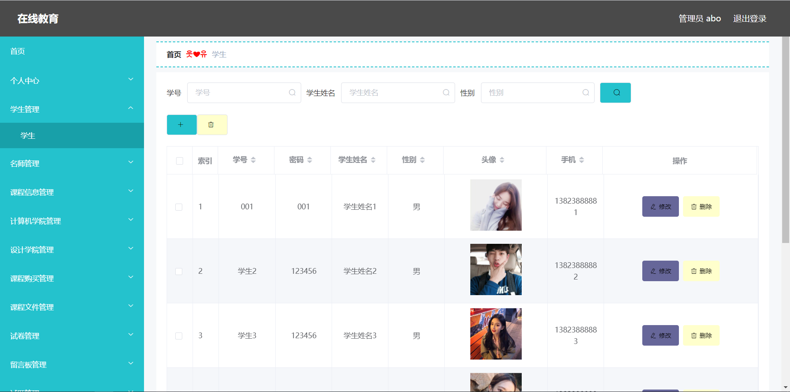
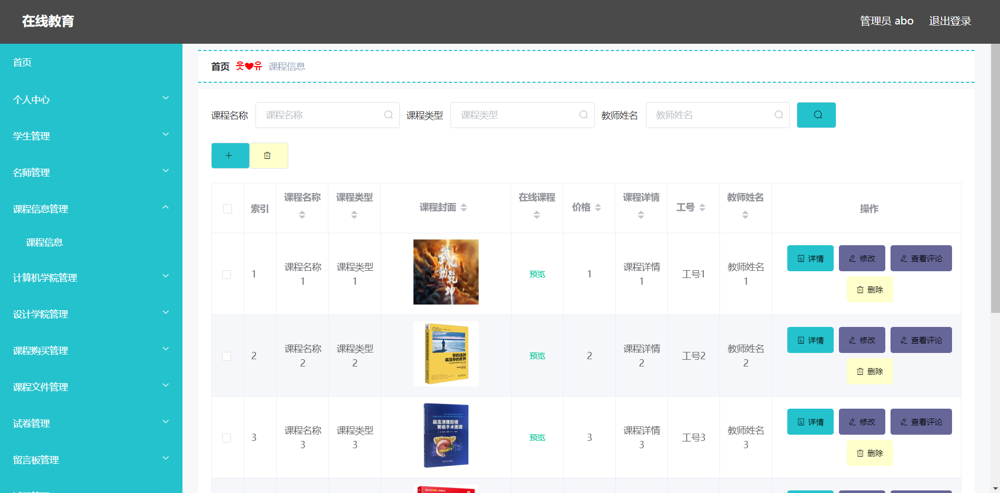
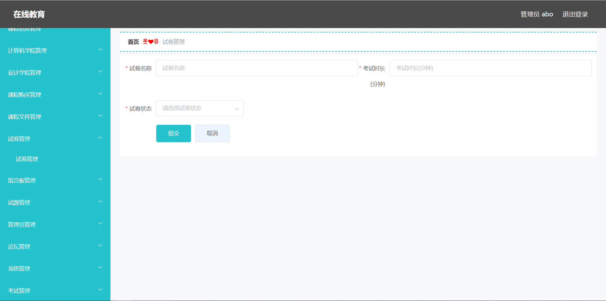
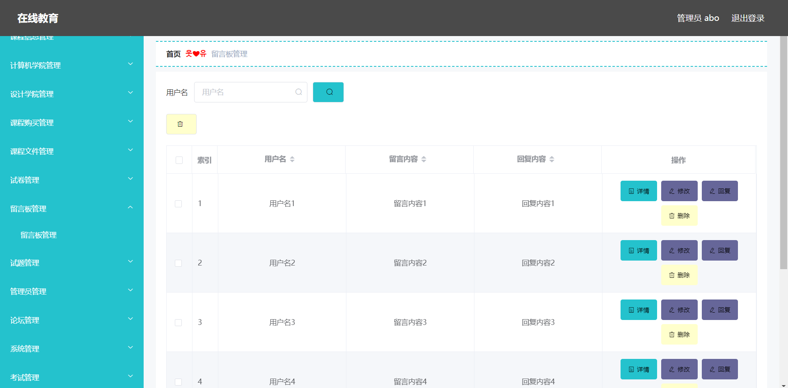
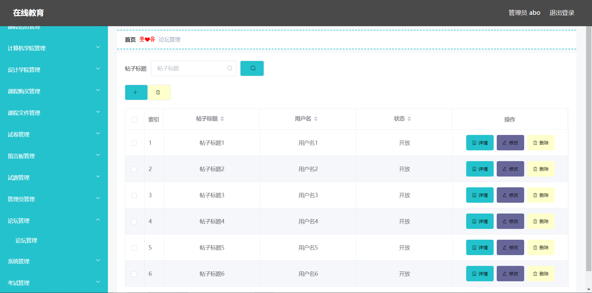
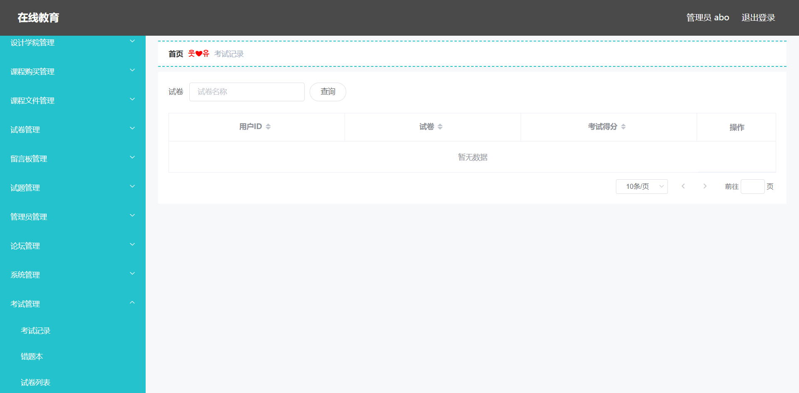
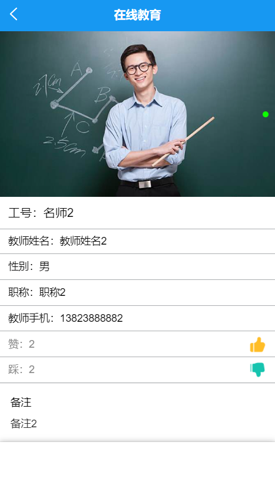
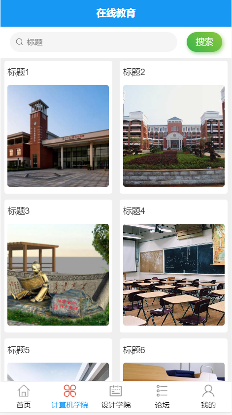
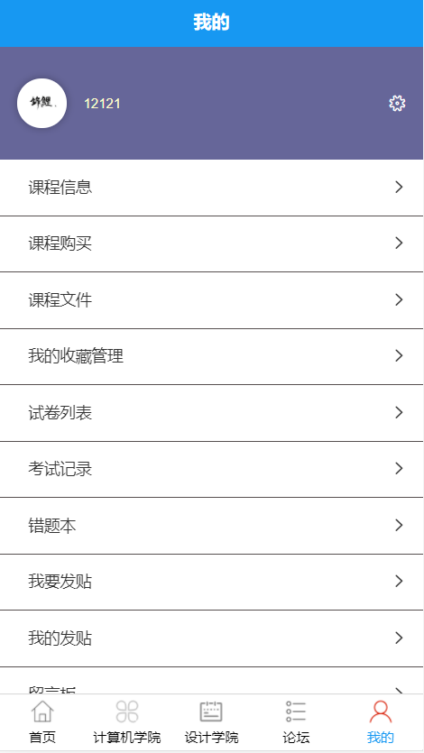
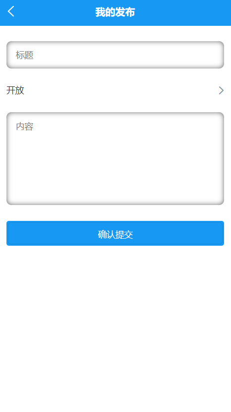

#  **Vue——思文教育** 
## 前言

思文教育包含前端App和后端管理系统两大模块，前端App包括首页、计科院、设计学院、论坛等页面。后台系统包括学生管理、名师管理、试卷管理等模块。后台系统的用户身份包含管理员和名师，管理员登录后可对系统进行更新和维护，名师登录可以修改自己的相关信息。前端App对于学生用户可以进行课程浏览、名师浏览、考试、留言评论等操作。

# 技术栈
CSS3 + HTML5 + Vue.js(2.6.11)+ Vuex(3.2.0) + uni-app+[vue-element-admin](http://panjiachen.github.io/vue-element-admin)++ Element-UI (2.2.10)+ Axios(0.19.0)

## 项目运行

HBuilderX运行

npm run dev

## 实现功能

（1）浏览课程：主要向用户展现课程列表，提供查看详情和学习的功能；

（2）分类：主要让用户可以选择自身需要且适合自己的课程或导师；

（3）登陆：用户信息的查询与获取并开始学习购买不同课程；

（4）注册：让用户通过输入信息可以得到一个应用账户；

（5）购买：课程对应的视频详情可以进行购买支付观看学习；

（6）考试：用户登录后可以进行考试，后台系统中可以设计、发起考试；

（7）评论留言：用户可以对系统或者单个课程或者名师进行评论。

## TODO

前端App包括首页、计科院、设计学院、论坛等页面。后台系统包括学生管理、名师管理、试卷管理等模块

## 屏幕截图

